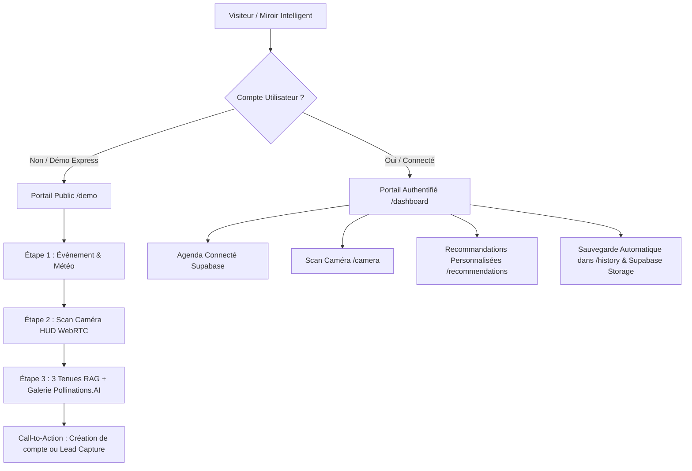

# 🚀 WALKTHROUGH — Skill 2 : Portails Double-Flux & Pipeline Caméra vers Pollinations.AI

## 📋 Résumé des Réalisations

Le **Skill 2** a été intégralement implémenté pour doter Reflecto d'une architecture à **double parcours** fluide et d'un raccordement strict et performant entre l'analyse visuelle de la caméra et le moteur de rendu de mode Pollinations.AI.

---

## 🏛️ 1. Architecture des Portails Double-Flux



### 1.1 Portail Public Démo Express (`/demo`)
- **Accès sans inscription** : Déverrouillé dans `lib/supabase/middleware.ts` pour contourner la redirection `/login`.
- **Support Double-Source Caméra** : Bascule instantanée entre la webcam locale et le flux Wi-Fi du module **ESP32-CAM** (`https://fastapiforreflecto.onrender.com/stream`).
- **Tunnel interactif en 3 étapes** :
  1. **Écran 1 (Contexte)** : Sélection d'occasion clé (*Gala, Entretien, Mariage, Bureau, Cocktail, Casual*) + champ personnalisé libre + détection météo en direct + sélection de ciblage vestimentaire.
  2. **Écran 2 (Scan Caméra)** : HUD miroir avec overlay de guidage visage/buste, switch Webcam/ESP32, capture instantanée redimensionnée (max 800x600 px) et détection IA immédiate (`/api/analyze-outfit`).
  3. **Écran 3 (Recommandations)** : 3 tenues haute couture adaptées au morphotype et à l'événement, galerie de photos de mode générées en direct via Pollinations.AI, badge de métadonnées RAG actif, et synthèse vocale française (TTS).

### 1.2 Portail Connecté (`/dashboard`, `/camera`, `/recommendations`, `/history`)
- Conserve l'historique complet, les préférences profil, le module ESP32 et la persistance des images générées sur Supabase Storage.

---

## 📸 2. Pipeline Caméra $\to$ Recommandations $\to$ Pollinations.AI

### 2.1 Extraction des Attributs Visuels (`/api/analyze-outfit`)
Le modèle de vision extrait obligatoirement le format normalisé suivant :
```json
{
  "gender": "male" | "female" | "unisex",
  "morphology": "H-Shape" | "V-Shape" | "A-Shape" | "X-Shape" | "O-Shape",
  "silhouette": "Athlétique et structurée",
  "skinTone": "Warm" | "Cool" | "Medium" | "Fair" | "Dark",
  "currentOutfitColors": ["navy", "white"],
  "confidence": 0.92,
  "suggestions": "Conseils stylistiques en français..."
}
```

### 2.2 Transmission vers Pollinations.AI (`lib/services/image-service.ts`)
La fonction `buildOutfitPrompt` prend désormais en charge à la fois un profil Supabase ou le `VisualContext` extrait en direct :
```typescript
export function buildOutfitPrompt(
  outfitDescription: string,
  context?: VisualContext | Profile | null
): string {
  const gender = context?.gender === "female" ? "female high fashion model" : "male high fashion model";
  const bodyType = context?.morphology || "balanced silhouette";
  const skinTone = context?.skinTone || "natural skin complexion";

  return [
    `full body editorial fashion photography`,
    `${gender} wearing ${outfitDescription}`,
    `${bodyType} body shape`,
    `${skinTone} skin tone`,
    `vibrant high-end luxury editorial style`,
    `crisp details, 8k resolution, elegant studio lighting`,
    `clean minimalist studio background`
  ].join(", ");
}
```

---

## 🔒 3. Conformité RGPD & Cycle de Vie Caméra (Kill-Switch WebRTC)

- **Gestionnaire centralisé (`lib/camera-context.tsx`)** :
  - La caméra est active uniquement sur `/camera`, `/miror` et `/demo`.
  - Dès que l'utilisateur quitte la page ou navigue vers un autre onglet, toutes les pistes WebRTC (`MediaStreamTrack`) sont immédiatement détruites via `track.stop()`.
  - Aucune image vidéo brute n'est stockée sur disque sans consentement.

---

## 🧪 4. Protocole de Test & Validation

### Test 1 : Validation de l'accès public (Démo Express)
1. Ouvrir le navigateur en mode navigation privée (sans session active).
2. Taper l'URL : `http://localhost:3000/demo` (ou cliquer sur *"Tester en mode Invité"* sur `/login`).
3. **Résultat attendu** : La page s'affiche directement sans redirection vers `/login`.

### Test 2 : Validation du scan et de la différenciation des modèles
1. **Étape 1** : Choisir l'événement *"✨ Soirée Gala & Prestige"* et ciblage *"Homme"*.
2. **Étape 2** : Activer la caméra, cliquer sur *"Scanner mon look"*.
   - Vérifier l'apparition des badges de morphologie (ex. `V-Shape`) et de carnation (`Warm`).
3. **Étape 3** : Cliquer sur *"Découvrir mes 3 tenues"*.
   - Vérifier que les 3 tenues correspondent au code vestimentaire Gala.
   - Vérifier que les photos Pollinations.AI affichent des mannequins masculins en tenue de gala.
4. Recommencer avec ciblage *"Femme"* $\to$ vérifier que les photos génèrent des modèles féminins en robe de soirée / tailleur gala.

### Test 3 : Validation de l'arrêt caméra (Kill-Switch RGPD)
1. Être sur l'étape 2 du `/demo` (caméra allumée).
2. Cliquer sur le lien *"Se connecter"* en haut à droite.
3. **Résultat attendu** : Le voyant lumineux de la webcam s'éteint immédiatement.
