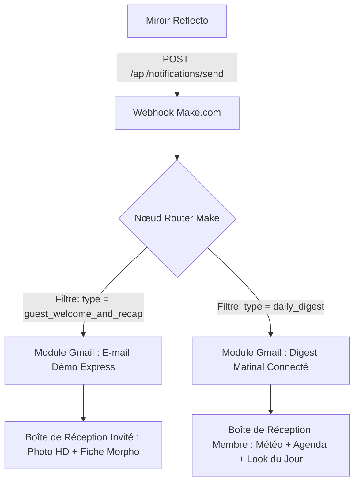

# 🚀 WALKTHROUGH — Skill 3 : Automatisation des E-mails via Make.com (Integromat)

## 📋 Résumé des Réalisations

Le **Skill 3** a été intégralement implémenté pour doter Reflecto d'un système de notification par e-mail automatisé et intelligent relié aux webhooks **Make.com**, couvrant :
1. **Le Lead Capture en mode Invité (Démo Express)** : Modale Glassmorphism permettant d'envoyer instantanément la tenue générée et les conseils du styliste.
2. **Le Digest Matinal (Utilisateurs Connectés)** : Déclenchement automatisé des rappels d'agenda, météo locale et recommandation de style personnalisée via `/api/cron/daily-digest`.

---

## 🏛️ 1. Architecture & Flux de Données Make.com



---

## 📦 2. Schémas JSON des Payloads Envoyés à Make.com

### 2.1 Payload Démo Invité (`type: "guest_welcome_and_recap"`)
```json
{
  "type": "guest_welcome_and_recap",
  "user_email": "visiteur@example.com",
  "event_context": "Soirée Gala & Prestige",
  "detected_profile": {
    "gender": "male",
    "morphology": "V-Shape",
    "skin_tone": "Warm",
    "suggestions": "Silhouette élancée. Les coupes cintrées et les camaïeux de couleurs sublimeront votre style."
  },
  "weather": {
    "temp": 23,
    "condition": "Ensoleillé",
    "location": "Antananarivo"
  },
  "recommended_outfit": {
    "name": "Allure Signature Prestige",
    "description": "Tenue parfaitement ajustée pour Soirée Gala & Prestige, mettant en valeur votre silhouette V-Shape.",
    "image_url": "https://image.pollinations.ai/prompt/...",
    "tags": ["Haute Couture", "Sur-Mesure", "Élégance"],
    "match": 96
  },
  "sent_at": "2026-09-14T11:20:00.000Z"
}
```

### 2.2 Payload Utilisateur Connecté (`type: "daily_digest"`)
```json
{
  "type": "daily_digest",
  "user_email": "membre@example.com",
  "user_name": "Alexandre",
  "weather": {
    "temp": 24,
    "condition": "Ensoleillé",
    "advice": "Météo agréable idéale pour des cotons légers et des blazers fluides.",
    "location": "Antananarivo"
  },
  "events": [
    { "title": "Comité de Direction", "time": "09:30", "type": "Business" },
    { "title": "Déjeuner Partenaire", "time": "12:45", "type": "Casual" }
  ],
  "recommended_outfit": {
    "name": "Look Signature - Comité de Direction",
    "description": "Composé spécialement pour votre silhouette H-Shape et vos rendez-vous du jour.",
    "context": "Comité de Direction",
    "image_url": "https://image.pollinations.ai/prompt/...",
    "tags": ["Sur-Mesure", "RAG Actif", "Haute Couture"],
    "match": 95
  },
  "sent_at": "2026-09-14T07:00:00.000Z"
}
```

---

## 🛠️ 3. Guide de Configuration Pas-à-Pas dans Make.com

### Étape 1 : Nœud Webhook (Trigger)
1. Dans Make.com, créez un nouveau scénario.
2. Ajoutez un module **Custom Webhook** (Webhooks $\to$ Custom Webhook).
3. Cliquez sur **"Add"**, nommez-le `Reflecto Notification Receiver`.
4. Copiez l'URL fournie (ex: `https://hook.eu1.make.com/sma51eiuax8zy7qv763o7tva6heibcp0`).
5. Collez cette URL dans `web-app/frontend/reflecto-app/.env.local` :
   ```env
   MAKE_WEBHOOK_URL=https://hook.eu1.make.com/sma51eiuax8zy7qv763o7tva6heibcp0
   ```

---

### Étape 2 : Nœud Router (Aiguillage des 2 flux)
1. Ajoutez un module **Router** (Flow Control) juste après le Webhook.
2. **Branche 1 (Haut)** $\to$ Cliquez sur la clé à molette entre le Router et le module suivant pour créer un filtre :
   - **Label** : `Filtre Démo Express`
   - **Condition** : `type` *(Text: Equals to (case insensitive))* `guest_welcome_and_recap`
3. **Branche 2 (Bas)** $\to$ Cliquez sur la clé à molette pour créer un deuxième filtre :
   - **Label** : `Filtre Daily Digest`
   - **Condition** : `type` *(Text: Equals to (case insensitive))* `daily_digest`

---

### Étape 3 : Paramétrage du Nœud Gmail (Branche Démo Express)
Ajoutez le module **Gmail $\to$ Send an Email** sur la Branche 1 :

| Paramètre Make | Valeur à insérer |
|---|---|
| **To** | `1. user_email` |
| **Subject** | `✨ Votre sélection de style Reflecto pour {{1.event_context}}` |
| **Content type** | `HTML` |
| **Content** | *(Copier-coller le Template HTML ci-dessous)* |

#### 📝 Template HTML pour l'E-mail Démo Express :
```html
<!DOCTYPE html>
<html>
<head>
  <meta charset="utf-8">
  <style>
    body { font-family: 'Helvetica Neue', Helvetica, Arial, sans-serif; background-color: #050b14; color: #f8fafc; margin: 0; padding: 20px; }
    .container { max-width: 600px; margin: auto; background: #0f172a; border: 1px solid rgba(212,165,116,0.3); border-radius: 20px; padding: 30px; box-shadow: 0 10px 30px rgba(0,0,0,0.5); }
    .header { text-align: center; border-bottom: 1px solid rgba(255,255,255,0.1); padding-bottom: 20px; }
    .logo { color: #d4a574; font-size: 26px; font-weight: bold; letter-spacing: 2px; }
    .title { color: #ffffff; font-size: 20px; margin-top: 20px; }
    .badge { display: inline-block; background: rgba(212,165,116,0.15); color: #d4a574; padding: 5px 12px; border-radius: 12px; font-size: 12px; font-weight: bold; border: 1px solid rgba(212,165,116,0.3); margin: 5px; }
    .card { background: #1e293b; border-radius: 16px; overflow: hidden; margin-top: 25px; border: 1px solid rgba(255,255,255,0.05); }
    .card-img { width: 100%; max-height: 400px; object-fit: cover; }
    .card-body { padding: 20px; }
    .outfit-name { font-size: 20px; font-weight: bold; color: #d4a574; margin: 0 0 10px 0; }
    .outfit-desc { font-size: 14px; color: #94a3b8; line-height: 1.6; }
    .quote-box { background: rgba(0,212,255,0.08); border-left: 3px solid #00d4ff; padding: 12px 16px; border-radius: 8px; font-style: italic; color: #cbd5e1; font-size: 13px; margin-top: 15px; }
    .btn { display: inline-block; background: #d4a574; color: #050b14; text-decoration: none; padding: 12px 28px; border-radius: 12px; font-weight: bold; font-size: 14px; margin-top: 25px; }
    .footer { text-align: center; font-size: 11px; color: #64748b; margin-top: 30px; border-top: 1px solid rgba(255,255,255,0.05); padding-top: 15px; }
  </style>
</head>
<body>
  <div class="container">
    <div class="header">
      <div class="logo">REFLECTO</div>
      <p style="color: #64748b; font-size: 12px; margin: 5px 0 0 0;">L'Élégance Connectée & Haute Couture IA</p>
    </div>

    <h2 class="title">Votre tenue idéale pour {{1.event_context}}</h2>

    <div style="margin-top: 10px;">
      <span class="badge">Morphologie : {{1.detected_profile.morphology}}</span>
      <span class="badge">Teint : {{1.detected_profile.skin_tone}}</span>
      <span class="badge">Météo : {{1.weather.temp}}°C {{1.weather.condition}}</span>
    </div>

    <div class="card">
      
      <div class="card-body">
        <h3 class="outfit-name">{{1.recommended_outfit.name}} ({{1.recommended_outfit.match}}% Match)</h3>
        <p class="outfit-desc">{{1.recommended_outfit.description}}</p>
      </div>
    </div>

    <div class="quote-box">
      "{{1.detected_profile.suggestions}}"
    </div>

    <div style="text-align: center;">
      <a href="https://reflecto.app/login" class="btn">Créer mon Compte Reflecto & Synchroniser mon Agenda</a>
    </div>

    <div class="footer">
      Reflecto Smart Mirror • Propulsé par IA RAG & Vision • Vos données restent protégées.
    </div>
  </div>
</body>
</html>
```

---

### Étape 4 : Paramétrage du Nœud Gmail (Branche Daily Digest)
Ajoutez un second module **Gmail $\to$ Send an Email** sur la Branche 2 :

| Paramètre Make | Valeur à insérer |
|---|---|
| **To** | `1. user_email` |
| **Subject** | `✨ Bonjour {{1.user_name}}, votre sélection de style et météo du jour` |
| **Content type** | `HTML` |
| **Content** | *(Template similaire intégrant la liste des événements du jour `{{1.events}}` et la météo `{{1.weather.temp}}°C`)* |

---

## 🧪 4. Protocole de Test Immédiat

### Test 1 : Envoi depuis le Portail Démo Express (`/demo`)
1. Allez sur `http://localhost:3000/demo`.
2. Effectuez les étapes 1 et 2 (Scan caméra).
3. À l'Étape 3, cliquez sur le bouton **"Recevoir par E-mail"** (ou sur **"Recevoir ce look par e-mail"** sous une carte).
4. Saisissez votre adresse e-mail dans la modale Glassmorphism et validez.
5. **Résultat** :
   - Toast de succès dans l'interface Reflecto.
   - Le scénario Make.com s'allume en vert (exécution réussie).
   - Vous recevez un e-mail HTML avec la photo de mode Pollinations.AI et vos fiches de style !

### Test 2 : Déclenchement du Cron Utilisateur Connecté
1. Appelez l'URL locale : `http://localhost:3000/api/cron/daily-digest`
2. **Résultat** :
   - Réponse JSON : `{"success": true, "message": "Daily digest traité pour X utilisateur(s)"}`.
   - Les e-mails de la branche 2 sont expédiés via Make.com.
